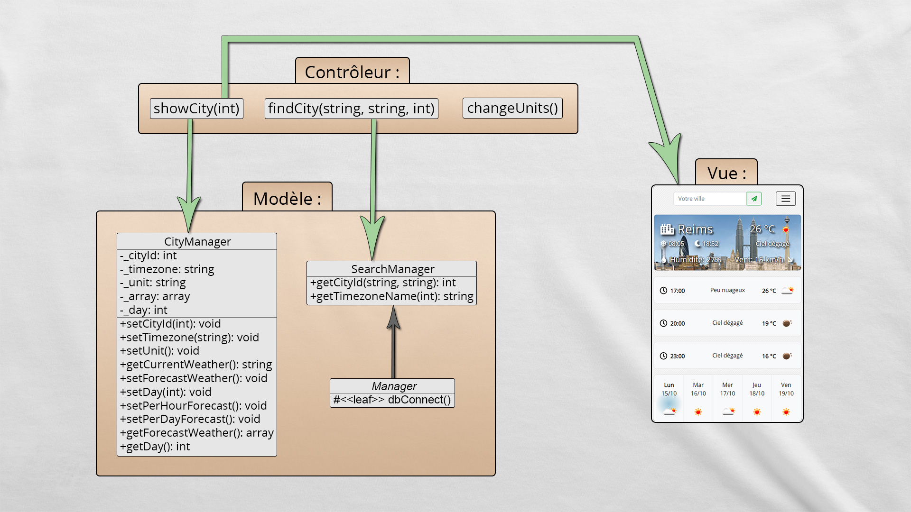

# Weather UX-Friendly

API used : 
* OpenWeatherMap
* Google Places Autocomplete
* Google Timezone

## Installation & configuration

1. Create your database and import : \SQL\weather.sql

2. Edit the file : \models\Manager.php

```php
$db = new \PDO('mysql:host=HOST;dbname=DATABASE;charset=utf8', 'USERNAME', 'PASSWORD');
```

3. Edit the file : \settings\config.php

```php
define("TITLE", "META_TITLE");
define("DESCRIPTION", "META_DESCRIPTION");
define("OPENWEATHERMAP_APIKEY", "YOUR_API_KEY");
define("GOOGLE_APIKEY", "YOUR_API_KEY");
```

## UML Diagram



## Contributing
Pull requests are welcome.

For major changes, please open an issue first to discuss what you would like to change.

## Author
[Anthony Dieudonné](https://anthony-dieudo.fr)

## License
[MIT](https://choosealicense.com/licenses/mit/)