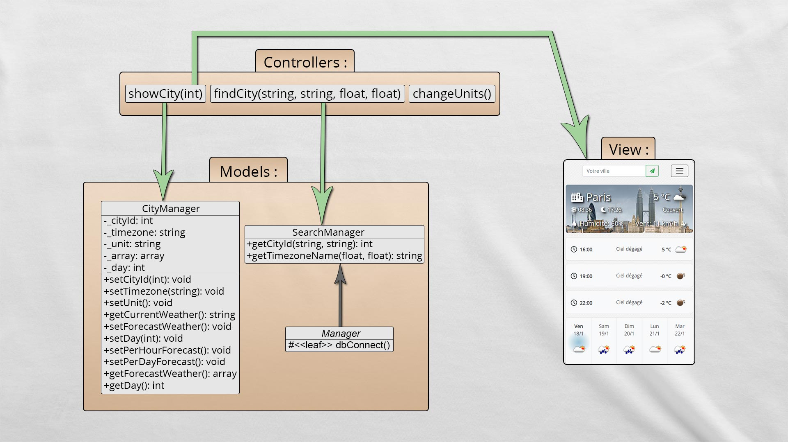

# Weather UX-Friendly

This app use the API : 
* OpenWeatherMap
* Google Places Autocomplete
* Google Timezone

## Installation & configuration

1. Edit the file : /models/Manager.php

```php
$db = new \PDO('mysql:host=HOST;dbname=DATABASE;charset=utf8', 'USERNAME', 'PASSWORD');
```

2. Edit the file : /settings/config.php

```php
define("TITLE", "META_TITLE");
define("DESCRIPTION", "META_DESCRIPTION");
define("OPENWEATHERMAP_APIKEY", "YOUR_API_KEY");
define("GOOGLE_APIKEY", "YOUR_API_KEY");
```

## UML Diagram



## Contributing
Pull requests are welcome.

For major changes, please open an issue first to discuss what you would like to change.

## Author
[Anthony Dieudonné](https://anthony-dieudo.fr)

## License
[MIT](https://choosealicense.com/licenses/mit/)